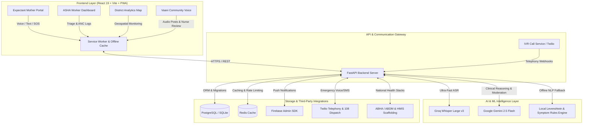

# 🌸 Vyana Care (व्यान केयर) — AI Maternal Health Platform

<div align="center">

[](https://frontend-ayushs-projects-76f1503f.vercel.app)
[](https://vyana-care.onrender.com)
[](https://vyana-care.onrender.com/docs)
[](https://python.org)
[](https://fastapi.tiangolo.com)
[](https://react.dev)
[](LICENSE)

**India's First Voice-First, Offline-Resilient AI Maternal Health Companion & ASHA Triage Network**

[Explore Live Web App](https://frontend-ayushs-projects-76f1503f.vercel.app) • [Interactive API Swagger Docs](https://vyana-care.onrender.com/docs) • [Deployment Runbook](Vyana/PRODUCTION_DEPLOYMENT_RUNBOOK.md) • [Pitch Script](Vyana/DEMO_SCRIPT.md)

</div>

---

## 📌 Live Deployments

| Resource | URL | Status |
| :--- | :--- | :--- |
| 📱 **Web Application (Vercel)** | [https://frontend-ayushs-projects-76f1503f.vercel.app](https://frontend-ayushs-projects-76f1503f.vercel.app) | 🟢 Live |
| ⚡ **Backend REST API (Render)** | [https://vyana-care.onrender.com](https://vyana-care.onrender.com) | 🟢 Live |
| 📖 **Interactive Swagger Docs** | [https://vyana-care.onrender.com/docs](https://vyana-care.onrender.com/docs) | 🟢 Live |
| 📚 **ReDoc API Documentation** | [https://vyana-care.onrender.com/redoc](https://vyana-care.onrender.com/redoc) | 🟢 Live |

---

## 🎯 The Problem

Every 20 minutes in India, a mother loses her life to preventable pregnancy complications. In rural areas across states like Bihar, Uttar Pradesh, and Rajasthan, up to **70% of maternal deaths occur because critical warning signs** (such as pre-eclampsia, hemorrhage, or severe anemia) are detected too late.

Rural mothers face **three fatal systemic barriers**:
1. **Linguistic & Literacy Barriers**: Rural mothers cannot type or read complex medical English.
2. **Connectivity Deserts**: 2G/3G network drops and poor cellular coverage leave women stranded during emergencies.
3. **Overburdened Frontline Health Workers**: A single ASHA worker monitors 1,000+ residents with paper registers, leading to delayed escalations.

---

## 💡 The Solution: Vyana Care

**Vyana Care (व्यान केयर)** bridges the rural healthcare divide through a multimodal, AI-powered ecosystem designed specifically for low-resource environments:

- 🎙️ **Voice-First Interaction**: Natural speech-to-speech interaction in Hindi and regional dialects using Groq Whisper-large-v3 and Google Gemini 2.5 Flash.
- 📶 **Offline-First Resilience**: Local fuzzy-matching clinical engine and PWA background queues ensure zero downtime even without internet.
- 🚨 **Instant Emergency SOS**: 1-tap 108 Emergency Ambulance dispatch with automated GPS coordinate transmission and Twilio telephony alerts.
- 👩‍⚕️ **ASHA Worker Intelligence**: AI-triaged risk queues, automated ANC follow-up scheduling, and one-click WhatsApp outreach.
- 🗣️ **Vaani Community Voice Platform**: Peer-to-peer audio forum with AI toxicity/medical safety moderation and clinical nurse review.
- 📊 **District Epidemiological Dashboard**: Geospatial heatmaps, regional risk analytics, IVR voice screening integration, and federated learning simulations.
- 🏛️ **Government Digital Health Ready**: Built-in scaffolding for Ayushman Bharat Health Account (ABHA), HMIS reporting, and India's DPDP Act 2023 compliance.

---

## 🏗️ System Architecture



---

## ✨ Key Features & Capabilities

### 1. 🎙️ Multimodal Voice-First Symptom Triaging
- Instant speech-to-speech conversation in Hindi and regional dialects.
- AI extracts symptoms, estimates severity, checks gestational risks, and returns culturally grounded dietary/medical advice.
- Automatic fallback to embedded local clinical dictionary if internet connectivity is lost.

### 2. 🚨 Golden-Hour Emergency SOS & Dispatch
- Floating 1-tap SOS trigger with a 3-second accidental tap cancellation countdown.
- Auto-dials **108 National Emergency Ambulance Service**.
- Dispatches automated Twilio emergency SMS with patient name, trimester, and village GPS coordinates to designated ASHA workers.

### 3. 👩‍⚕️ ASHA Didi Triage & Care Coordination
- Real-time priority queue flagging High / Medium / Low maternal risks.
- One-click alert acknowledgment, ANC checkup logging, and direct WhatsApp / telephony follow-up.
- Automated generation of printable clinical referral cards.

### 4. 🗣️ Vaani / Awaaz — Community Audio Network
- Safe peer support space for rural mothers to ask questions via voice notes.
- Dual-layer moderation: Automated AI screening for medical misinformation/toxicity + Clinical Nurse verification dashboard.
- Audio playback and transcription in native language.

### 5. 📊 District Health Management & Epidemiological Map
- Interactive Leaflet-powered GIS map displaying high-risk cluster zones by village and sub-center.
- Real-time telemetry: ANC coverage rates, high-risk case distributions, and emergency dispatch histories.
- Interactive IVR simulation for automated telephony screening across non-smartphone feature phones.
- Federated learning simulator demonstrating privacy-preserving decentralized model updates across PHCs.

### 6. 🔒 DPDP Act 2023 & Security Compliance
- End-to-end data encryption with phone number masking in audit logs.
- Dedicated user consent logs, data portability export endpoints, and right-to-be-forgotten deletion workflows.

---

## 🛠️ Technology Stack

| Layer | Technologies |
| :--- | :--- |
| **Backend** | Python 3.11+, FastAPI, SQLAlchemy, PostgreSQL, SQLite, Pydantic, APScheduler |
| **AI & Voice** | Groq API (`whisper-large-v3`), Google Generative AI (`gemini-2.5-flash`), Local Regex/Fuzzy Matching |
| **Frontend** | React 19, Vite, Material UI (MUI v7), Framer Motion, Emotion, Recharts, Leaflet, React-Leaflet |
| **Telephony & Messaging** | Twilio REST API, Firebase Admin SDK, Web Speech API |
| **Caching & Storage** | Redis 5.2, FastAPICache2, Aiofiles, ReportLab (PDF Generation) |
| **DevOps & Hosting** | Docker, Docker Compose, Render (Backend), Vercel (Frontend) |

---

## 📁 Repository Structure

```
Vyana care/
├── .gitignore                      # Git ignore configuration
├── LICENSE                         # MIT License
├── README.md                       # Root documentation (this file)
└── Vyana/                          # Application Root
    ├── app/                        # FastAPI Backend Application
    │   ├── main.py                 # FastAPI initialization & route registration
    │   ├── database.py             # SQLAlchemy engine & session management
    │   ├── models.py               # Database schemas (Patients, Symptoms, Alerts, Vaani)
    │   ├── schemas.py              # Pydantic request/response validation
    │   ├── routers/                # API Route modules
    │   │   ├── auth.py             # JWT, OTP & Refresh Token authentication
    │   │   ├── patient.py          # Patient registration, profiles, health records
    │   │   ├── symptom.py          # AI Symptom analysis & risk scoring
    │   │   ├── asha.py             # ASHA worker triage & alert actions
    │   │   ├── awaaz.py            # Vaani voice community & nurse moderation
    │   │   ├── district.py         # District analytics & GIS metrics
    │   │   ├── ivr.py              # Twilio IVR telephony flows
    │   │   ├── sync.py             # Offline batch sync & Bluetooth payloads
    │   │   ├── abha.py             # ABHA ID & ABDM registry simulation
    │   │   └── federated.py        # Federated learning round simulations
    │   └── services/               # Core business & AI integrations
    │       ├── ai_service.py       # Groq Whisper & Gemini 2.5 Flash pipeline
    │       ├── offline_engine.py   # Local offline symptom fuzzy matcher
    │       ├── notification.py     # Firebase & Twilio alerting engine
    │       └── security.py         # Encryption, hashing & DPDP workflows
    ├── frontend/                   # React + Vite Frontend Application
    │   ├── public/                 # Static assets & Service Worker manifest
    │   ├── src/
    │   │   ├── api/                # Axios API client & backend endpoints
    │   │   ├── components/         # Reusable UI components (VoiceMic, SOSModal, etc.)
    │   │   ├── context/            # Global state (AuthContext, LanguageContext)
    │   │   ├── pages/              # Views (VyanaHome, AshaDashboard, DistrictDashboard, etc.)
    │   │   ├── App.jsx             # Router & layout composition
    │   │   └── main.jsx            # React root mount
    │   ├── package.json            # Frontend dependencies & scripts
    │   └── vite.config.js          # Vite configuration & proxy rules
    ├── tests/                      # Automated test suite (Pytest)
    ├── Dockerfile                  # Production containerization
    ├── docker-compose.yml          # Multi-container orchestration (App + DB + Redis)
    ├── render.yaml                 # Render infrastructure-as-code blueprint
    ├── requirements.txt            # Python dependencies
    ├── seed.py                     # Demo data seeding script
    ├── DEMO_SCRIPT.md              # 3-Minute pitch & judging walkthrough
    ├── ENV_SETUP_GUIDE.md          # Complete environment variable setup manual
    ├── PRODUCTION_DEPLOYMENT_RUNBOOK.md # Production deployment handbook
    └── SECURITY_AND_PRIVACY.md     # DPDP Act compliance & threat model
```

---

## 🚀 Quickstart & Local Setup

### Prerequisites
- Python 3.11+
- Node.js 18+ and npm
- Git

### 1. Clone the Repository
```powershell
git clone https://github.com/WhiteGod0227/Vyana-care.git
cd "Vyana-care\Vyana"
```

### 2. Backend Setup
```powershell
# Create and activate virtual environment
python -m venv .venv
.\.venv\Scripts\Activate.ps1   # On Linux/macOS: source .venv/bin/activate

# Install dependencies
pip install -r requirements.txt

# Configure environment variables
copy .env.example .env

# Optional: Seed sample test data
python seed.py

# Start backend server
python -m uvicorn app.main:app --host 127.0.0.1 --port 8001 --reload
```
Backend API will be live at: **`http://127.0.0.1:8001`**  
Swagger docs available at: **`http://127.0.0.1:8001/docs`**

### 3. Frontend Setup
In a new terminal:
```powershell
cd "Vyana-care\Vyana\frontend"

# Configure frontend environment
copy .env.example .env

# Install packages & start development server
npm install
npm run dev
```
Frontend will be live at: **`http://localhost:5173`**

---

## 🔑 Environment Configuration

Vyana Care supports flexible execution across local development (SQLite), staging, and production (PostgreSQL + Redis).

Refer to [ENV_SETUP_GUIDE.md](Vyana/ENV_SETUP_GUIDE.md) for full configuration options:

| Key | Description | Example / Default |
| :--- | :--- | :--- |
| `DATABASE_URL` | SQLAlchemy DB connection URI | `sqlite:///./vyana.db` or `postgresql://...` |
| `GROQ_API_KEY` | Groq API Key for Whisper-large-v3 | `gsk_...` |
| `GEMINI_API_KEY` | Google Gemini API Key | `AIzaSy...` |
| `TWILIO_ACCOUNT_SID` | Twilio Account SID for SMS/IVR | `AC...` (optional for demo) |
| `TWILIO_AUTH_TOKEN` | Twilio Auth Token | `...` |
| `FIREBASE_CREDENTIALS_PATH` | Path to Firebase service account JSON | `vyana-care-firebase.json` |
| `JWT_SECRET_KEY` | Secret for signing auth tokens | `supersecretkey123` |

---

## 🧪 Testing Suite

Execute the comprehensive automated test suite:

```powershell
# Run backend tests
pytest tests/ -v

# Run targeted endpoint tests
python test_endpoints.py
python test_error_handling.py
python test_voice_flow.py
```

---

## 🐳 Container Deployment (Docker)

Launch the entire stack (FastAPI + PostgreSQL + Redis) with a single command:

```powershell
docker compose up --build -d
```

---

## 📜 Regulatory & Privacy Compliance

Vyana Care is architected in strict adherence to **India's Digital Personal Data Protection (DPDP) Act 2023** and **Ayushman Bharat Digital Mission (ABDM)** standards:
- **Data Minimization**: Audio recordings are processed in memory and discarded post-transcription unless explicitly opted into research.
- **Granular Consent**: Explicit consent logs recorded before storing any maternal health metrics.
- **Right to Erasure**: Complete purge workflows available via `/patient/delete-request`.
- See [SECURITY_AND_PRIVACY.md](Vyana/SECURITY_AND_PRIVACY.md) for detailed threat models and compliance matrices.

---

## 👥 Contributors & Acknowledgements

- **Developed with ❤️ by**: Ayush Kumar Singh ([@WhiteGod0227](https://github.com/WhiteGod0227))
- **Live Demo Link**: [https://frontend-ayushs-projects-76f1503f.vercel.app](https://frontend-ayushs-projects-76f1503f.vercel.app)
- **License**: [MIT License](LICENSE)
