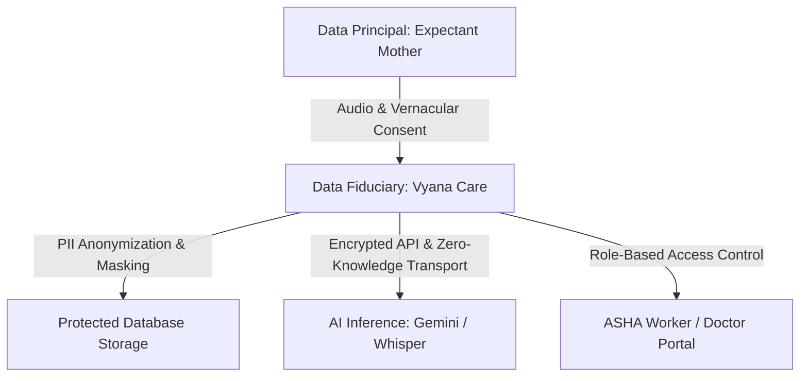

# 🛡️ Vyana Care — Security, Privacy & DPDP Compliance Guide

> **Document Version:** 1.0 (Production Grade)  
> **Regulatory Alignment:** Digital Personal Data Protection (DPDP) Act 2023 (India), Ayushman Bharat Digital Mission (ABDM) Guidelines, HIPAA Data Security Principles.

---

## 🏛️ 1. Regulatory Alignment Overview (DPDP Act 2023)

Vyana Care handles sensitive personal health data for pregnant women and newborns in rural ecosystems. The system is engineered around the core principles of India's **DPDP Act 2023**:



### Key Pillars:
1. **Notice & Consent:** Vernacular voice and text disclosures explaining what data is recorded and why.
2. **Purpose Limitation:** Maternal health data is utilized strictly for clinical triage, ANC scheduling, and emergency dispatch.
3. **Data Minimization:** No unnecessary biometric or financial data is ever collected.
4. **Right to Erasure & Correction:** Endpoints allow mothers or ASHA workers to correct vitals or request anonymization.

---

## 🔒 2. Personally Identifiable Information (PII) Masking

### 2.1 Telephone & Contact Masking
To protect vulnerable rural women from unsolicited contact or data scraping, all public API responses and dashboard summary views apply strict phone number masking:

```python
# app/core/security.py / app/services/patient_service.py
def mask_phone_number(phone: str) -> str:
    """
    Transforms '+919876543210' -> '+91 ******3210'
    Preserves country code and last 4 digits for verification while concealing the rest.
    """
    if not phone or len(phone) < 6:
        return "******"
    return f"{phone[:3]} ******{phone[-4:]}"
```

### 2.2 Health Records & Audio Data
- **Voice Stream Handling:** Temporary voice audio files uploaded for Whisper transcription (`uploads/`) are processed in memory or deleted immediately after transcription completes.
- **Transcripts:** Voice transcripts undergo sensitive entity sanitization before caching.

---

## 🏥 3. Ayushman Bharat Digital Mission (ABDM) & ABHA Linkage

Vyana Care integrates with India's **Ayushman Bharat Health Account (ABHA)** standard:
- **14-Digit Format:** Validates standard `XX-XXXX-XXXX-XXXX` ABHA identifiers.
- **No Aadhaar Storing:** Aadhaar numbers are never stored in plain text or indexed; only NHA-issued ABHA addresses/tokens are linked to patient profiles.
- **Health Data Interoperability:** Patient checkup records (BP, Hemoglobin, Weight, Gestational Age) follow FHIR-compliant schema definitions for easy export to government Primary Health Centre (PHC) portals.

---

## 🔐 4. Secret Isolation & Zero-Leakage Architecture

### 4.1 Client-Side Protection (Frontend)
- **Zero Secrets in JavaScript Bundles:** The frontend only consumes public configuration variables prefixed with `VITE_` (e.g., `VITE_API_BASE_URL`, `VITE_APP_NAME`).
- **No AI or SMS Keys in Client:** Gemini API keys, Groq tokens, Twilio Auth Tokens, and Firebase Private Keys are **strictly kept on the FastAPI backend server**.

### 4.2 Git Repository Cleanliness
- Root `.gitignore` and `frontend/.gitignore` exclude:
  - `.env`, `.env.local`, `.env.production`
  - Service account JSON keys (`*-firebase-adminsdk-*.json`)
  - SQLite databases (`*.db`, `*.sqlite`)
  - Private SSL/TLS certificates (`*.pem`, `*.key`)

---

## 👥 5. Role-Based Access Control (RBAC) Matrix

| Resource / Endpoint | Mother (Public / Voice) | ASHA Worker | Primary Health Centre Doctor | System Admin |
|---|---|---|---|---|
| **Voice AI & Chat Guidance** | ✅ Read / Write (Self) | ✅ Read / Write | ✅ Read Only | ✅ Full |
| **Emergency SOS Trigger** | ✅ Trigger Only | ❌ | ❌ | ✅ Full |
| **Full Patient Roster** | ❌ | ✅ Assigned Village | ✅ PHC District Cohort | ✅ Full |
| **Patient Phone Number** | ❌ (Masked) | ✅ Unmasked (Authorized) | ✅ Unmasked | ✅ Full |
| **Log ANC Medical Vitals** | ❌ | ✅ Write / Update | ✅ Clinical Sign-off | ✅ Full |
| **Server Configuration** | ❌ | ❌ | ❌ | ✅ Root Admin |

---

## 🚨 6. Emergency SOS Safety Protocol

1. **Anti-Accidental Triggering:** The SOS button incorporates a **3-second safety abort countdown** to prevent false alarms from pocket taps or children playing with phones.
2. **Location Security:** GPS coordinates are transmitted over HTTPS TLS 1.3 encryption directly to the Twilio dispatch webhook and designated ASHA recipient.
3. **Audit Trail:** Every SOS event logs an immutable timestamped entry in the database (`alerts` table) with trigger source, response status, and resolution timestamp.

---

## 📋 7. Production Security Hardening Checklist

- [x] **CORS Configuration:** Restrict `BACKEND_CORS_ORIGINS` to specific production domains in `.env`.
- [x] **HTTP Security Headers:** Vercel / Nginx configured with `X-Frame-Options: DENY`, `X-Content-Type-Options: nosniff`, and `Strict-Transport-Security`.
- [x] **Database Security:** Dynamic SSL mode enabled for PostgreSQL (`sslmode=require`).
- [x] **Safe Fallbacks:** Offline fuzzy-matching operates locally without sending unencrypted external network requests.
